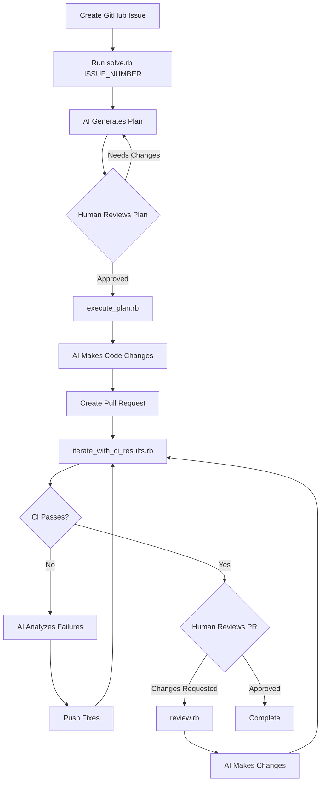

# NITL - Human-In-The-Loop AI Factory

A Ruby-based toolset for automating software development workflows using AI (Claude Code) in a human-in-the-loop pattern. Create GitHub issues, generate implementation plans, execute code changes, and iterate through CI failures automatically.

## Overview

This toolset provides a streamlined workflow for fixing bugs, implementing features, or making code changes by combining AI-powered code generation with human oversight. The process flows from issue creation → plan generation → execution → CI iteration → human review.

## Workflow



## Prerequisites

Before using these scripts, ensure you have the following tools installed:

- **[GitHub CLI](https://cli.github.com/)** (`gh`) - Must be authenticated (`gh auth login`)
- **[Claude Code CLI](https://code.claude.com/)** (`claude`) - For AI-powered code generation
- **[jq](https://stedolan.github.io/jq/)** - JSON processor (install via `brew install jq` on macOS)
- **[curl](https://curl.se/)** - HTTP client (usually pre-installed)
- **[worktrunk](https://github.com/max-sixty/worktrunk)** (`wt`) - Git worktree management tool
- **Ruby** - Ruby interpreter (scripts use standard library only)

## Configuration

Create a `.env` file in the repository root with your CircleCI API token:

```bash
CIRCLE_CI_API_TOKEN=your_token_here
```

The scripts automatically load environment variables from this file. The CircleCI token is required for monitoring build status and fetching failure details.

## Usage

### 1. Create and Solve an Issue

```bash
./solve.rb 123
```

This command:
- Fetches GitHub issue #123
- Uses Claude Code to generate a detailed plan saved to `plans/plan_gh_issue_no_123.md`
- Prompts you to review and approve the plan
- Automatically proceeds to execution once approved

The plan includes:
- Analysis of the issue
- Approach to solving it
- Test cases to verify the solution
- Implementation steps
- Potential risks or considerations
- Questions for clarification (if needed)

### 2. Execute Plan (Automatic)

`execute_plan.rb` is automatically invoked by `solve.rb`, but can also be run manually:

```bash
./execute_plan.rb 123
```

This script:
- Reads the plan from `plans/plan_gh_issue_no_123.md`
- Creates a git worktree for branch `issue-123`
- Uses Claude Code to implement the plan
- Commits changes (including the plan file)
- Pushes the branch and creates a pull request
- Automatically proceeds to CI monitoring

**Note:** The AI is instructed not to run tests locally, but instead to push a PR and rely on CI.

### 3. Iterate with CI Results (Automatic)

`iterate_with_ci_results.rb` is automatically invoked after PR creation:

```bash
./iterate_with_ci_results.rb 123 [PR_NUMBER]
```

This script:
- Monitors CircleCI build status for the PR
- Waits up to 1 hour for builds to complete
- If CI passes: exits successfully
- If CI fails: extracts failure details, uses Claude Code to fix issues, pushes fixes, and iterates
- Maximum of 10 retry attempts

Failure details are saved to `tmp/issue-{NUMBER}_failure_details_{ITERATION}.txt` for reference.

### 4. Handle PR Review Feedback

When reviewers request changes on a PR:

```bash
./review.rb 123
```

This script:
- Switches to the worktree for branch `issue-123`
- Prompts you to enter feedback (multi-line input, press Enter 3 times to submit)
- Uses Claude Code to analyze the feedback and make changes
- Pushes the changes and monitors CI again

### 5. Clean Up (Optional)

To delete a branch and its worktree after completion:

```bash
./delete_solution.rb 123
```

This removes:
- Local branch `issue-123`
- Remote branch `issue-123`
- Associated worktree

## Scripts Overview

| Script | Purpose | Auto-Invoked By |
|--------|---------|-----------------|
| `solve.rb` | Generate implementation plan for an issue | - |
| `execute_plan.rb` | Execute plan and create PR | `solve.rb` |
| `iterate_with_ci_results.rb` | Monitor CI and fix failures | `execute_plan.rb`, `review.rb` |
| `review.rb` | Handle PR review feedback | - |
| `delete_solution.rb` | Clean up branches and worktrees | - |
| `utilities.rb` | Shared helper functions | All scripts |

## Directory Structure

The scripts create and manage the following:

```
.
├── .env                          # Environment variables (you create this)
├── plans/                        # Generated plans (created automatically)
│   └── plan_gh_issue_no_123.md  # Example plan file
├── tmp/                          # CI failure details (created automatically)
│   └── issue-123_failure_details_1_1.txt
└── [worktree directories]        # Managed by worktrunk
```

## Key Features

- **Worktree Isolation**: Each issue gets its own git worktree via worktrunk, keeping your main working directory clean
- **Automatic CI Integration**: Monitors CircleCI builds, extracts failure details, and iteratively fixes issues
- **Human Oversight**: Plans require approval before execution, and PRs can be reviewed before merging
- **Failure Recovery**: Automatically retries up to 10 times to fix CI failures
- **Branch Management**: Automatic branch creation, PR creation, and cleanup utilities
- **Plan Persistence**: All plans are saved for reference and context during iterations

## Workflow Tips

1. **Start Clean**: Ensure you don't have uncommitted changes before running `solve.rb` (or commit/stash them first)
2. **Review Plans Carefully**: The plan review step is your opportunity to catch issues before code changes
3. **Monitor Output**: Scripts provide colored output (ℹ info, ✓ success, ⚠ warning, ✗ error) to track progress
4. **PR Linking**: PRs automatically reference the GitHub issue (e.g., "Fixes #123") for proper linking
5. **CI Timeout**: CI monitoring waits up to 1 hour for builds to complete
6. **Max Retries**: If CI fails more than 10 times, the script exits and requires manual intervention

## Example Session

```bash
# 1. Create a GitHub issue describing the bug/feature
# 2. Solve it:
./solve.rb 456

# Review the generated plan at plans/plan_gh_issue_no_456.md
# Answer any questions Claude asked, then approve

# 3. Script automatically:
#    - Executes the plan
#    - Creates PR #789
#    - Monitors CI
#    - Fixes failures if needed

# 4. Review the PR on GitHub

# 5. If changes are needed:
./review.rb 456
# Enter your feedback, press Enter 3 times

# 6. After merging, clean up:
./delete_solution.rb 456
```

## Error Handling

The scripts include error handling for common scenarios:
- Missing GitHub authentication
- Uncommitted changes (with warning)
- Duplicate branches (must delete first)
- Missing plan files
- CI timeout or max retries exceeded
- Missing required tools

All errors provide clear messages about what went wrong and how to resolve the issue.
