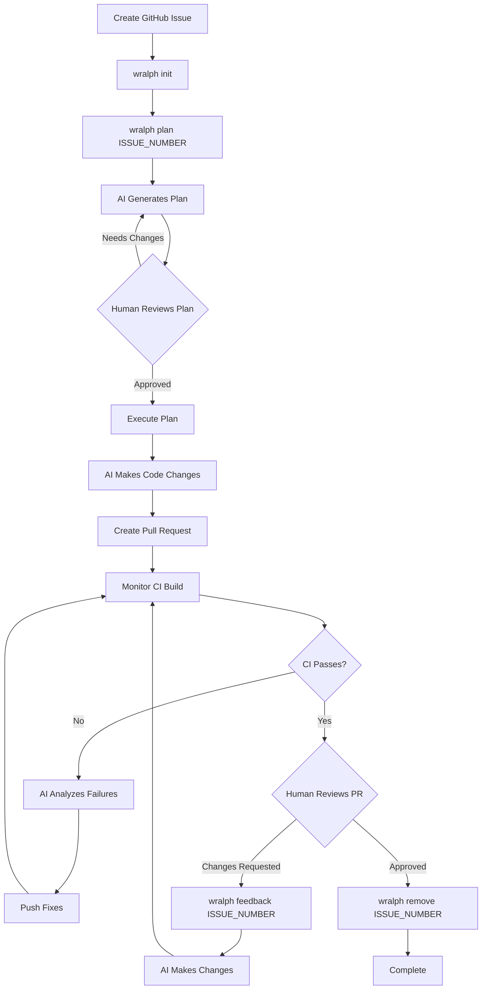

# wralph

A Human-In-The-Loop AI Factory CLI. `wralph` wraps a coding agent and CI to autonomously complete software objectives—planning, executing, creating PRs, and iterating on CI failures—while keeping a human in the loop.

## How It Works

`wralph` uses the "Ralph Wiggum" technique: point an AI agent at an issue, let it plan and code, then iterate on CI failures until the build passes. What sets it apart:

- **Git worktrees** isolate each issue, so multiple instances can run on the same repo without interference
- **Remote CI evaluation** (default: CircleCI) means parallel instances never conflict
- **Pluggable adapters** for objective sources, CI systems, and AI agents



## Prerequisites

- **[Ruby](https://www.ruby-lang.org/)** `>= 3.0`
- **[GitHub CLI](https://cli.github.com/)** (`gh`) — authenticated via `gh auth login`
- **[Claude Code CLI](https://code.claude.com/)** (`claude`) or **[OpenCode](https://opencode.ai/)** (`opencode`)
- **[worktrunk](https://github.com/max-sixty/worktrunk)** (`wt`) — git worktree management
- **[jq](https://stedolan.github.io/jq/)** and **[curl](https://curl.se/)**

## Installation

```bash
brew tap niborg/homebrew-wralph
brew install wralph
```

For development:

```bash
git clone https://github.com/niborg/wralph
cd wralph
bundle install
```

## Quick Start

```bash
# Initialize in your repo
wralph init

# Edit .wralph/secrets.yaml with your CI API token
# Edit .wralph/config.yaml to configure adapters

# Plan and execute an issue (creates PR, monitors CI, auto-fixes failures)
wralph plan 123

# After PR review, address feedback
wralph feedback 123

# Clean up after merge
wralph remove 123
```

## Commands

| Command | Description |
|---------|-------------|
| `wralph init` | Initialize `wralph` in the current repo (creates `.wralph/` directory) |
| `wralph plan <issue>` | Generate a plan, execute it, create a PR, and monitor CI |
| `wralph execute <issue>` | Execute an existing plan (skips plan generation) |
| `wralph feedback <issue>` | Apply PR review feedback, push changes, and monitor CI |
| `wralph act_on_ci_results <issue>` | Re-enter CI monitoring loop for an existing PR |
| `wralph set_config <issue>` | Copy `.wralph/` contents to the issue's worktree |
| `wralph remove <issue>` | Delete branch, remote branch, and worktree |

## Configuration

Running `wralph init` creates a `.wralph/` directory:

```
.wralph/
├── config.yaml    # Adapter and prompt configuration
├── secrets.yaml   # CI API token (git-ignored)
├── plans/         # Generated plans
└── objectives/    # Downloaded issues
```

### `config.yaml`

```yaml
repo:
  branch_name: "issue-#{identifier}"   # Branch naming template

objective_repository:
  source: github_issues                # or "custom" with class_name

ci:
  source: circle_ci                    # or "custom" with class_name

agent_harness:
  source: claude_code                  # claude_code, opencode, or "custom"
  flags:
    - dangerously-skip-permissions     # CLI flags passed to the agent

prompts:
  plan: ...           # Customize the planning prompt
  execute_with_plan: ...
  execute_without_plan: ...
  feedback: ...
  ci: ...
```

### `secrets.yaml`

```yaml
ci_api_token: your_circleci_token_here
```

### Custom Adapters

Set `source: custom` and provide `class_name` for any adapter. Place the implementation file in `.wralph/` using snake_case naming (e.g., `class_name: MyAdapter` → `.wralph/my_adapter.rb`).

## Behavior Notes

- Plans are saved to `.wralph/plans/plan_<issue>.md` for reference
- CI failures are logged to `tmp/` with iteration numbers
- CI monitoring polls every 30s, with a 1-hour timeout
- Failed CI triggers up to 10 automatic fix-and-retry cycles
- Feedback input uses multi-line mode (press Enter 3 times to submit)
- The agent is instructed to push to CI rather than run tests locally

## Development

```bash
bundle exec rspec      # Run tests
rubocop lib/wralph/    # Lint
```
